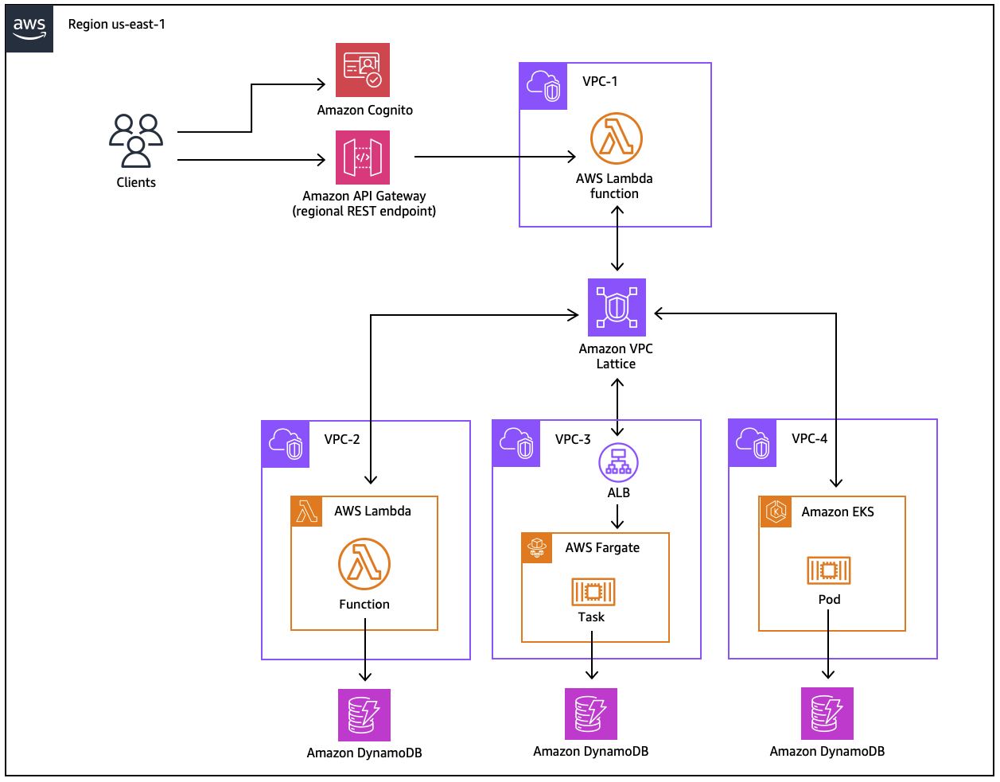

## Overview
This repository packages applications and deploys them across three separate compute platforms on AWS: Lambda, ECS, and EKS. They are integrated with VPC Lattice to allow clients in other AWS accounts and separate VPCs to communicate with those backend services, simplifying east-west communication between internal applications.

## Modules
This repository has a number of directories that can be deployed as modules.

The following should be deployed first to set up the core infrastructure.
* `vpc`: VPC to be used in each associated account, deployed using CDK
* `spring`: Spring Boot application that is deployed in all relevant accounts, deployed using CloudFormation or SAM

The next can be deployed in any order, depending on your requirements.
* `api`: Frontend API client into VPC Lattice using SAM
* `lambda`: Lambda function using SAM
* `ecs`: ECS cluster, task, and service setup using SAM
* `eks`: EKS cluster setup using `eksctl`, IAM role setup using CloudFormation, deployments using `kubectl`

Note that the intention of this architecture was to deploy the same Spring Boot application to Lambda, ECS, and EKS. However, due to an [outstanding issue](https://github.com/awslabs/aws-serverless-java-container/issues/639), the Lambda backend was implemented as a simple hello world application. The Lambda backend will be updated when that issue is resolved.

## Security
See [CONTRIBUTING](CONTRIBUTING.md#security-issue-notifications) for more information.

## License
This library is licensed under the MIT-0 License. See the LICENSE file.